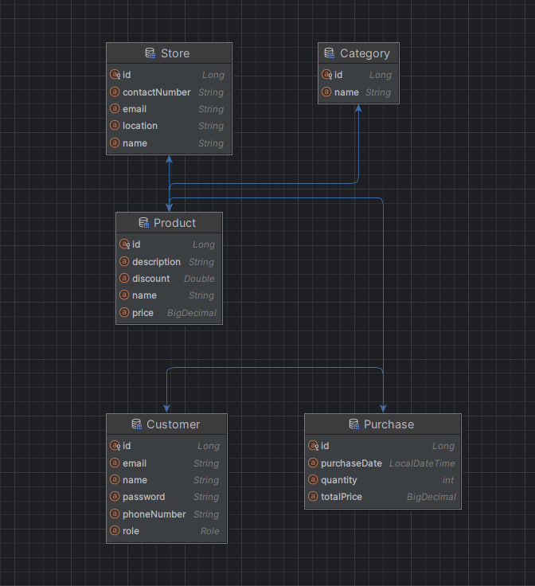
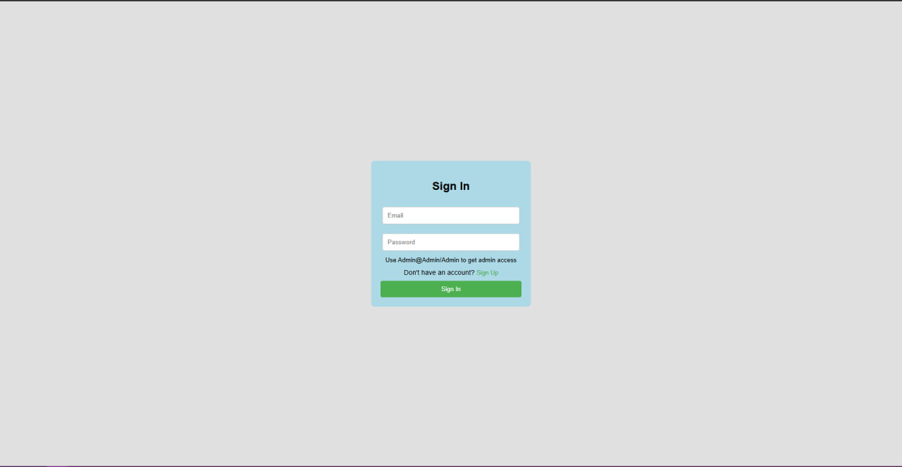
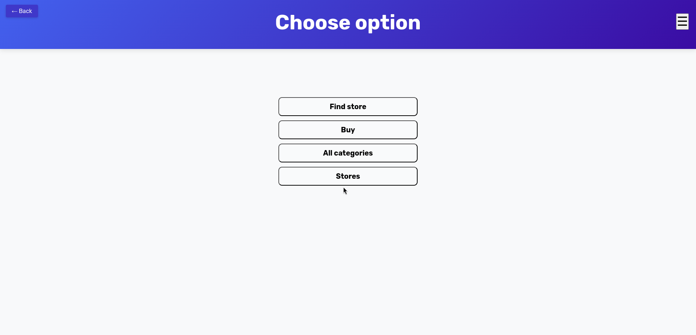
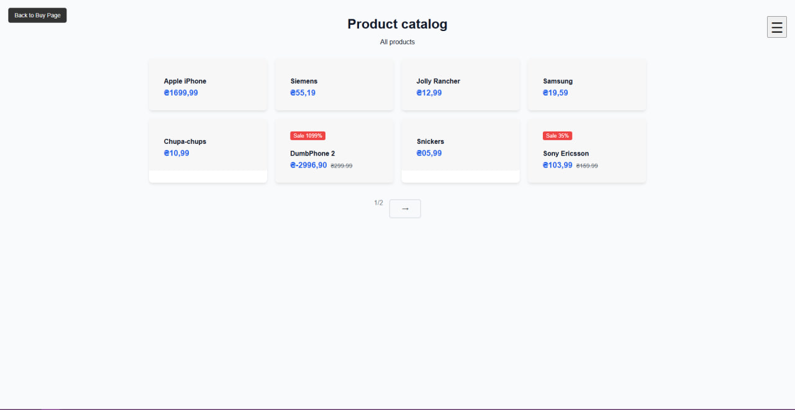
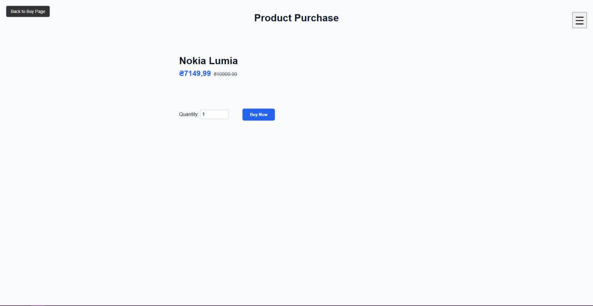
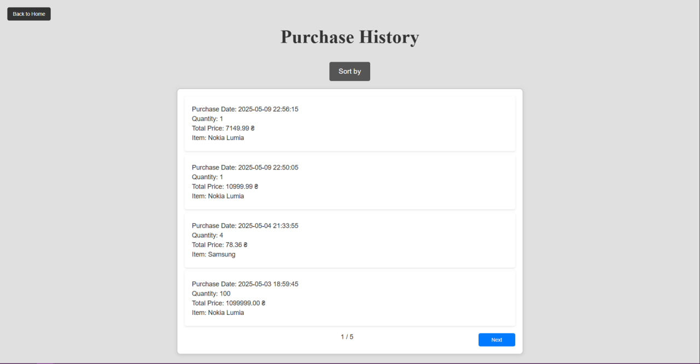

# 🛒 Проект: Система управління покупками в магазинах

## 🎯 Мета

Реалізувати Java-додаток, який моделює просту систему купівлі продуктів у магазинах.

## ✅ Реалізовані можливості
- Логін та реєстрація 
- Перегляд усіх товарів
- Перегляд усіх категорій та їх товарів
- Перегляд усіх магазинів та їх товарів
- Перегляд усіх магазинів з певним товаром
- Покупка товару
- Додавання магазину
- Додавання товару у магазин
- Видалення магазину 
- Додавання товару
- Зміна товару
- Зміна категорії товару
- Видалення товару
- Додавання категорії
- Видалення категорії
- Збереження покупок в "Історії покупок", з збереженням дати та повної ціни
- Сортування по ціні та даті для історії покупок 
- Можливість для користувачів з адмін-доступом переглядати історію інших користувачів
- Можливість для користувачів з адмін-доступом додавати продукт, додавати продукт до категорії, та додати продукт до магазину
- Кастомний еррор-контроллер
- Також тести і захист від незалогінених користувачів 

## 📚 Опис сутностей

### 🧺 Product (Продукт)
- `id` — унікальний ідентифікатор
- `name` — назва продукту
- `price` — ціна
- `discount` - знижка
- `description` - опис товару
- 🔗 Належить до **однієї категорії**
- 🔗 Продається у **багатьох магазинах**

### 🗂 Category (Категорія)
- `id` — унікальний ідентифікатор
- `name` — назва категорії
- 🔗 Має **багато продуктів**

### 🏬 Store (Магазин)
- `id` — унікальний ідентифікатор
- `name` — назва магазину
- `location` — місце розташування
- 🔗 Продає **багато продуктів**

### 🧑‍💼 Customer (Покупець)
- `id` — унікальний ідентифікатор
- `name` — ім’я покупця
- `email` — електронна пошта
- `location` - місце розташування магазину
- `contactNumber` - контактний телефон
- 🔗 Може купувати **багато продуктів**

### 🧾 Purchase (Покупка)
- Додаткова сутність, яка зберігає інформацію про покупку:
    - `id` — унікальний ідентифікатор
    - `customer` — покупець
    - `product` — куплений продукт
    - `quantity` — кількість
    - `totalPrice` — загальна ціна
    - `purchaseDate` — дата покупки

## 🔗 Зв’язки між сутностями

- `Product` → `Category`: `ManyToOne`
- `Category` → `Product`: `OneToMany`
- `Product` ↔ `Store`: `ManyToMany`
- `Customer` ↔ `Product`: `ManyToMany` через `Purchase`

## Декілька фотографій інтерфейсу

## 🛠 Технології

- Java
- Spring Boot
- Hibernate (JPA)
- PostgreSQL
- Maven

